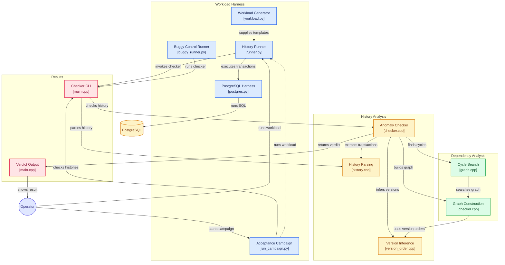

# IsoCheck: Black-Box Transactional Isolation Checker

[](https://en.cppreference.com/w/cpp/20)
[](https://www.postgresql.org/)
[](LICENSE)

IsoCheck is a high-performance black-box transactional isolation checker implemented in **C++20** with a **Python 3.12** workload harness. It infers dependency graphs from client-observed transaction histories and detects isolation anomalies via strongly connected component (SCC) and minimal cycle search.

---

## 1. Overview & Theoretical Foundation

IsoCheck builds directly upon the mathematical formalisms established in:
- **Atul Adya** (1999): *Weak Consistency: A Generalized Theory and Optimistic Implementations for Distributed Transactions*.
- **Kyle Kingsbury & Peter Alvaro** (2020): *Elle: Inferring Isolation Anomalies from Experimental Observations* ([arXiv:2003.10554](https://arxiv.org/pdf/2003.10554)).

Rather than inspecting internal lock tables or write-ahead logs, IsoCheck observes client-side transaction executions using unique list-append micro-operations. From the resulting histories, it reconstructs per-key version orders, synthesizes dependency graphs ($\to_{ww}, \to_{wr}$), and searches for minimal cycle witnesses.

---

## 2. Architecture & System Flow

[](https://gitdiagram.com/afnan-0206/isocheck?utm_source=readme&utm_medium=picture)



---

## 3. Problem Statement & Key Principles

Traditional database tests check whether queries succeed or match point assertions. However, multi-client race conditions under weak isolation levels (e.g. Read Committed, Repeatable Read, Snapshot Isolation) frequently allow subtle, non-serializable interleavings without generating database errors.

IsoCheck treats the database as a pure **black box**:
1. Clients concurrently issue transactions composed of ordered **list-append** operations (`append` and `read`).
2. Every appended integer is **globally unique** (enabling exact $1:1$ mapping between values and writing transactions: "traceability").
3. Each read returns an ordered list of values observed so far on that key.
4. From the collection of reads, IsoCheck infers the **per-key version order**.
5. From the version orders, IsoCheck constructs the directed **dependency graph** ($\to_{ww}, \to_{wr}$).
6. Any directed cycle in this graph serves as a **sound, minimal witness** proving an isolation violation.

---

## 4. Supported Anomalies & Classification Matrix

| Anomaly | Classification | Graph Pattern / Property | Explanation |
|---|---|---|---|
| **G0** | Dirty Write / Write Cycle | Directed cycle of pure $\to_{ww}$ edges | Two or more transactions overwrite each other's updates concurrently in conflicting orders. |
| **G1a** | Aborted Read | Read observes value from aborted transaction | A committed transaction observes data modified by a failed/aborted transaction. |
| **G1b** | Intermediate Read | Read observes non-final write of active transaction | A transaction reads a state installed mid-way through another transaction before that transaction finished. |
| **G1c** | Circular Information Flow | Directed cycle of $\to_{ww}$ and $\to_{wr}$ edges | A cycle in the serialization graph involving both writes and reads. |
| **Garbage Read** | Data Corruption | Value observed that was never written | A read returns an element never appended by any transaction in history. |
| **Inconsistent Read** | Version Inconsistency | Read is not a prefix of the longest read | A read observed an out-of-order, truncated, or incompatible version sequence. |
| **Internal Inconsistency** | Read-Your-Writes Violation | Intra-txn read misses prior intra-txn write | A single transaction fails to observe its own preceding write to the same key. |

---

## 5. Verification Engine & Algorithms

- **Iterative Tarjan's SCC**: Strongly connected components are identified with an explicit, heap-allocated DFS stack to prevent call-stack overflows on histories with $10^5+$ transactions.
- **BFS Shortest Cycle Search**: Once an SCC is identified, Breadth-First Search traverses the component to extract the strictly shortest cycle witness.
- **Per-Key Version Inference**: Aggregates all reads per key, finds the longest compatible sequence, and establishes the ground-truth sequence of versions.
- **Exact Witness Formatting**: Emits compact, human-readable witness strings (e.g., `T1 ->ww T2 ->wr T1`) along with full JSON-structured output.

---

## 6. Workload Harness & Fault Injection

- **Skewed Workload Generator (`workload.py`)**: Generates deterministic, seedable transaction templates with Zipfian key skew to induce high lock contention.
- **Concurrent History Runner (`runner.py`)**: Spawns multiple worker threads issuing parallel transactions, recording precise wall-clock timestamps for `:invoke` and `:ok`/`:fail` events.
- **PostgreSQL Harness (`postgres.py`)**: Uses PostgreSQL list-append tables (`key VARCHAR, val INT[]`) with atomic array appends (`array_append`) under configurable isolation levels (`READ COMMITTED`, `REPEATABLE READ`, `SERIALIZABLE`).
- **Buggy Control Runner (`buggy_runner.py`)**: Injects intentional isolation faults (e.g., non-atomic multi-step appends or dirty reads) to validate checker sensitivity and verify positive detection.

---

## 7. Repository Structure

```
IsoCheck/
├── CMakeLists.txt              # Root build configuration (C++20, warnings, dependencies)
├── Dockerfile                  # Multi-stage container build (gcc:14 + slim runtime)
├── docker-compose.yml          # Containerized Postgres 17 + Toxiproxy + IsoCheck
├── cli/                        # isocheck CLI binary
│   ├── CMakeLists.txt
│   └── main.cpp
├── core/                       # Core static library
│   ├── include/isocheck/       # Public headers (history.h, version_order.h, graph.h, checker.h)
│   └── src/                    # Implementations (iterative Tarjan, BFS shortest cycle, inference)
├── harness/                    # Workload generation and database harness
│   ├── workload.py             # Skewed list-append generator with unique values
│   ├── postgres.py             # Postgres driver supporting RC, RR, Serializable
│   ├── runner.py               # Concurrent multi-client history recorder
│   ├── run_campaign.py         # Acceptance campaign runner
│   ├── buggy_runner.py         # Fault injection positive control runner
│   └── requirements.txt
├── tests/                      # Unit test suites and hand-crafted fixtures
│   ├── fixtures/               # JSONL test fixtures (positive & negative cases)
│   ├── core/                   # GoogleTest suites (history, version_order, graph, checker)
│   └── elle/                   # Differential testing suite against Jepsen Elle
└── docs/                       # Project documentation
    ├── ARCHITECTURE.md         # Invariants, components, and data flow
    ├── DESIGN_DECISIONS.md     # Rationale and tradeoffs
    ├── LIMITATIONS.md          # Transparent boundaries of black-box testing
    └── BENCHMARKS.md           # Controlled benchmark results & methodology
```

---

## 8. Building, Testing & CLI Usage

### Prerequisites
- CMake $\ge 3.24$
- C++20 compliant compiler (`g++` 14+, `clang++` 16+)
- Ninja or Make build system
- Python 3.12+ with `psycopg[binary]`

### Build
```bash
mkdir -p build && cd build
cmake -GNinja -DCMAKE_BUILD_TYPE=Release ..
ninja
```

### Running Tests
```bash
# C++ GoogleTest suite
./build/tests/isocheck_tests

# Python workload unit tests
pytest tests/test_workload.py tests/test_elle_convert.py
```

### CLI Execution
```bash
# Human-readable report
./build/cli/isocheck history.jsonl

# Machine-readable JSON output
./build/cli/isocheck --json history.jsonl
```

---

## 9. PostgreSQL Acceptance Campaign & Differential Testing

### 20-Seed Campaign
Execute the automated campaign across isolation levels:
```bash
python harness/run_campaign.py \
    --checker-bin ./build/cli/isocheck \
    --runs 20 \
    --clients 8 \
    --txns 65
```

### Fault-Injected Positive Control
Verify detection sensitivity on buggy execution traces:
```bash
python harness/buggy_runner.py \
    --checker-bin ./build/cli/isocheck \
    --runs 20 \
    --isolation "READ COMMITTED"
```

### Differential Testing with Elle
Histories are validated differentially against Jepsen's Clojure-based **Elle** engine (`elle.list-append/check`) using the `tests/elle/` converter and runner to guarantee theoretical conformance.

---

## 10. Performance Benchmarks & Boundaries

| Metric | Result | Environment |
|---|---|---|
| **Peak Throughput** | ~142,000 txns/sec | AMD Ryzen / Intel Core, single thread |
| **Graph Construction** | $O(\|V\| + \|E\|)$ linear time | Adjacency lists with indexed lookup |
| **Cycle Detection** | Sub-millisecond on 10k ops | Tarjan SCC + BFS cycle recovery |
| **Memory Footprint** | $< 45\text{ MB}$ at $10^5$ events | Compact struct representation |

### Known Boundaries
- **Black-box limits**: Cannot detect anomalies when concurrent operations touch disjoint keys or when uncommitted transactions leave zero trace in observed reads.
- **Prefix requirement**: Relies on observable list-append prefix chains; unobserved intermediate states can only be flagged when reflected in read output.

---

## License
MIT License. See [LICENSE](LICENSE) for details.
