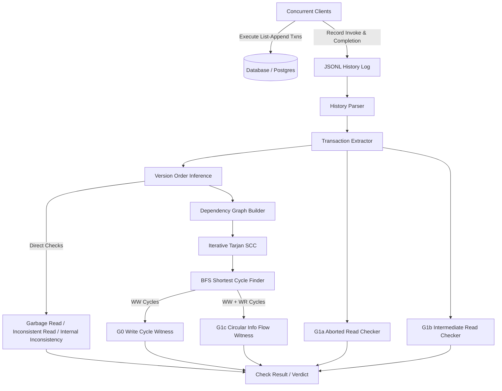

# IsoCheck Architecture & Invariants

IsoCheck is a black-box transactional isolation checker designed for SQL databases and distributed key-value stores. It infers dependency graphs from client-observed transaction histories and detects isolation anomalies via cycle detection and version order analysis, based on principles established in Adya et al. (2000) and the Jepsen/Elle framework (Kingsbury & Alvaro, 2020).

---

## 1. System Overview & Data Flow

### End-to-End Pipeline
1. **Workload Generation & Execution**: Clients issue transactions composed of ordered micro-operations (`append` and `read`) to distinct keys.
2. **History Logging**: Every client records the initial transaction intent (`invoke`) and the subsequent server response (`ok`, `fail`, or `info`) with high-resolution timestamps.
3. **History Parsing & Transaction Extraction**: The raw log is parsed; each `invoke` is paired with its completion event. Transactions that resulted in a definite `fail` are recorded for G1a detection but segregated from normal dependency ordering.
4. **Per-Key Version Order Inference**: For each key, reads from committed transactions are analyzed. The longest observed read establishes the ground-truth sequence of versions.
5. **Graph Construction**: Write-write (`ww`) and write-read (`wr`) directed edges are materialized between transactions.
6. **Cycle Finding & Classification**:
   - Tarjan's strongly connected components algorithm identifies cyclical subgraphs.
   - Breadth-First Search extracts minimal (shortest) witnesses.
   - Edge labels determine anomaly classification (G0 for pure `ww` loops, G1c for `ww` + `wr` loops).

---

## 2. Invariants & Guarantees

### Invariant 1: Append Value Uniqueness (Traceability)
* Every value appended across all transactions and keys is globally unique:
  $$\forall (t_1, k_1, v_1), (t_2, k_2, v_2): v_1 = v_2 \implies (t_1 = t_2 \land k_1 = k_2)$$
* **Why**: Uniqueness ensures an exact bijection between an observed value and the writing transaction:
  $$\text{value\_to\_txn}: \mathbb{Z} \to \text{TxnId}$$
  Without uniqueness, a read observing value $v$ could have originated from multiple potential writers, destroying deterministic dependency inference.

### Invariant 2: Version Prefix Consistency
* For any key $k$, let $L_k = [v_1, v_2, \dots, v_n]$ be the longest observed read sequence across all committed transactions.
* For every committed read $R$ of key $k$:
  $$R \sqsubseteq L_k$$
  ($R$ must be a strict prefix of $L_k$).
* **Why**: In a list-append register where appends are monotonic and commutative, any state is an append-only prefix of the latest state. A read that is not a prefix proves that updates were lost, observed out of order, or drawn from uncommitted/aborted states.

### Invariant 3: Indeterminate Outcome Soundness
* Timeouts, connection errors, and node crashes must be classified as `info`, never as `fail`.
* **Why**: A timed-out transaction may have committed on the database server before network partition or client disconnection. Classifying it as `fail` would lead to false positives (flagging benign reads as aborted reads) or false negatives (ignoring real cycles). Including `info` transactions conservatively ensures soundness.

### Invariant 4: No Self-Loops in Serialization Graph
* An edge $T_i \to T_j$ requires $T_i \neq T_j$.
* **Why**: By Adya's definition, internal intra-transaction causal ordering is verified by local state invariants, not by cyclic dependency in the multiversion serialization graph.

---

## 3. Component Details

### `core/history`
- Represents `MicroOp`, `Op`, `Transaction`, and `History`.
- Streaming JSONL parser parses line-by-line without loading the whole file into an intermediate DOM.
- Pairs `invoke` events with `ok`, `fail`, and `info` events.

### `core/version_order`
- Aggregates all reads per key from committed transactions.
- Computes the longest read for each key.
- Validates prefix inclusion for all observed reads.
- Flags non-cycle anomalies:
  - `InconsistentRead`: A read is not a prefix of the longest read.
  - `GarbageRead`: Read observed a value that was never appended.
  - `DuplicateWrite`: Two transactions attempted to append the same value.
  - `InternalInconsistency`: A transaction failed to observe its own prior writes within the same transaction.

### `core/graph`
- Adjacency-list directed graph with edge labels (`ww`, `wr`, and Phase 2 `rw`).
- **Iterative Tarjan's SCC**: Explicit heap-allocated stack prevents stack overflow when analyzing deep transaction graphs ($>10^6$ transactions).
- **BFS Shortest Cycle Search**: Finds minimal witnesses within each SCC, presenting the shortest cycle to users for easy diagnostic triage.

### `core/checker`
- Orchestrates:
  1. Extraction
  2. Version inference & non-cycle anomaly detection
  3. G1a (aborted read) detection: Checks if any committed transaction read a value written by an aborted (`fail`) transaction.
  4. G1b (intermediate read) detection: Checks if a transaction read a prefix that ended with an intermediate value of another multi-append transaction before that transaction committed.
  5. Dependency graph construction.
  6. G0 cycle search on the `ww` subgraph.
  7. G1c cycle search on the `ww + wr` subgraph (requiring $\ge 1$ `wr` edge).
